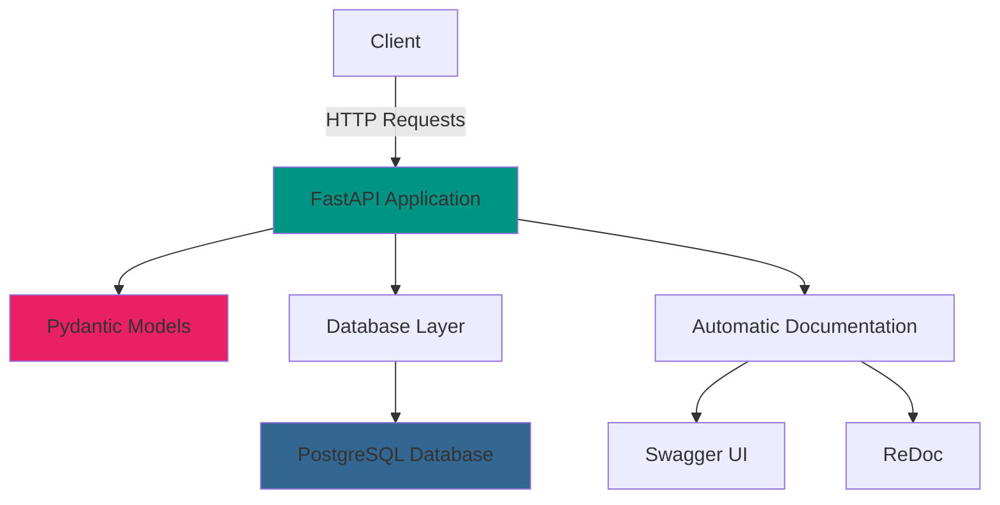

<div align="center">

# 🚀 FastAPI Backend System


[](https://fastapi.tiangolo.com/)
[](https://www.python.org/)
[](https://www.postgresql.org/)
[](https://pydantic.dev/)

*A high-performance, modern, and scalable backend API built with FastAPI*

[Features](#-features) • [Quick Start](#-quick-start) • [API Documentation](#-api-documentation) • [Contributing](#-contributing)

</div>

---

## ✨ Features

<table>
<tr>
<td>

### 🔥 **Core Features**
- **High Performance** - Built on Starlette and Pydantic
- **Type Hints** - Full Python type annotations
- **Automatic Docs** - Interactive API documentation
- **Modern Python** - Based on standard Python type hints

</td>
<td>

### 🗃️ **Database & Storage**
- **PostgreSQL Integration** - Robust relational database
- **Connection Pooling** - Automatic retry logic
- **Data Validation** - Pydantic models for type safety
- **CRUD Operations** - Complete user management system

</td>
</tr>
</table>

## 🏗️ Architecture



## 🚀 Quick Start

### Prerequisites

- Python 3.7+
- PostgreSQL 12+
- pip package manager

### Installation

1. **Clone the repository**
   ```bash
   git clone https://github.com/NayeemHossenJim/Backend-with-FastAPI.git
   cd Backend-with-FastAPI
   ```

2. **Create and activate virtual environment**
   ```bash
   python -m venv venv
   
   # Windows
   venv\Scripts\activate
   
   # macOS/Linux
   source venv/bin/activate
   ```

3. **Install dependencies**
   ```bash
   pip install -r requirements.txt
   ```

4. **Database Setup**
   ```sql
   -- Create PostgreSQL database and table
   CREATE DATABASE postgres;
   
   CREATE TABLE userdata (
       id SERIAL PRIMARY KEY,
       name VARCHAR(100) NOT NULL,
       age INTEGER NOT NULL,
       city VARCHAR(100) NOT NULL,
       created_at TIMESTAMP DEFAULT CURRENT_TIMESTAMP
   );
   ```

5. **Configure database connection**
   
   Update the database credentials in `main.py`:
   ```python
   connect = psycopg2.connect(
       host="localhost",
       database="postgres", 
       user="your_username",
       password="your_password"
   )
   ```

6. **Start the server**
   ```bash
   fastapi dev main.py
   ```

   🎉 Your API is now running at `http://localhost:8000`

## 📚 API Documentation

### Interactive Documentation

- **Swagger UI**: `http://localhost:8000/docs`
- **ReDoc**: `http://localhost:8000/redoc`

### Available Endpoints

<details>
<summary><strong>👤 User Management</strong></summary>

| Method | Endpoint | Description |
|--------|----------|-------------|
| `GET` | `/` | Get all users from database |
| `POST` | `/create_user` | Create a new user |
| `GET` | `/fetch_user/{id}` | Get user by ID |
| `PUT` | `/update_user/{id}` | Update existing user |
| `DELETE` | `/delete_user/{id}` | Delete user by ID |

</details>

<details>
<summary><strong>🔍 Examples & Demo</strong></summary>

| Method | Endpoint | Description |
|--------|----------|-------------|
| `GET` | `/path/{name}` | Path parameter example |
| `GET` | `/query?name=value` | Query parameter example |
| `GET` | `/mix/{name}?age=25` | Combined parameters |
| `GET` | `/optional/{name}?age=25` | Optional parameters |
| `POST` | `/user` | POST request example |

</details>

### Request/Response Examples

<details>
<summary><strong>Create User</strong></summary>

**Request:**
```bash
curl -X POST "http://localhost:8000/create_user" \
     -H "Content-Type: application/json" \
     -d '{
       "name": "John Doe",
       "age": 30,
       "city": "New York"
     }'
```

**Response:**
```json
{
  "New User": {
    "id": 1,
    "name": "John Doe",
    "age": 30,
    "city": "New York",
    "created_at": "2024-11-07T10:30:00"
  }
}
```

</details>

## 🛠️ Technology Stack

<div align="center">

| Category | Technology | Purpose |
|----------|------------|---------|
| **Framework** | FastAPI | High-performance web framework |
| **Database** | PostgreSQL | Primary data storage |
| **ORM/Database** | psycopg2 | PostgreSQL adapter |
| **Validation** | Pydantic | Data validation and settings |
| **Authentication** | PyJWT | JSON Web Token handling |
| **Task Queue** | Celery + Redis | Background task processing |
| **Code Quality** | Ruff + isort | Linting and formatting |
| **Email** | fastapi-mail | Email functionality |

</div>

## 📁 Project Structure

```
Backend-with-FastAPI/
├── 📄 main.py              # Main application file
├── 📄 requirements.txt     # Project dependencies  
├── 📄 README.md           # This file
├── 📄 LICENSE             # License file
└── 📁 __pycache__/        # Python cache files
```

## 🔧 Configuration

### Environment Variables

Create a `.env` file in the root directory:

```env
# Database Configuration
DATABASE_HOST=localhost
DATABASE_NAME=postgres
DATABASE_USER=your_username
DATABASE_PASSWORD=your_password
DATABASE_PORT=5432

# Application Settings
DEBUG=True
SECRET_KEY=your-secret-key-here
```

## 🚨 Error Handling

The API includes comprehensive error handling:

- **404 Not Found** - When user doesn't exist
- **422 Validation Error** - Invalid request data
- **500 Internal Server Error** - Database connection issues

## 🧪 Testing

```bash
# Run with pytest (install pytest first)
pip install pytest httpx
pytest
```

## 📈 Performance Features

- **Async/Await Support** - Non-blocking operations
- **Automatic Validation** - Request/response validation
- **Database Connection Pooling** - Efficient database usage
- **Type Safety** - Runtime and static type checking

## 🤝 Contributing

We welcome contributions! Please follow these steps:

1. Fork the repository
2. Create a feature branch (`git checkout -b feature/amazing-feature`)
3. Commit your changes (`git commit -m 'Add amazing feature'`)
4. Push to the branch (`git push origin feature/amazing-feature`)
5. Open a Pull Request

## 📝 License

This project is licensed under the MIT License - see the [LICENSE](LICENSE) file for details.

## 👨‍💻 Author

**Nayeem Hossen Jim**
- GitHub: [@NayeemHossenJim](https://github.com/NayeemHossenJim)

---